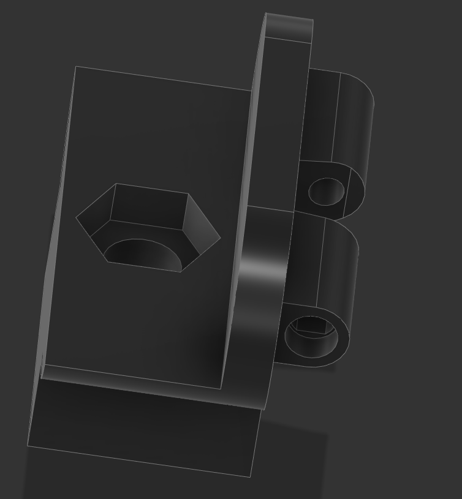

# 1/4"-20 and M5 mount for Logitech C310

I wanted to mount my C310 on an arm on my 3d printer for Octoprint, didn't find a good mount I liked for the camera.

# Changelog

2021/03/26 - Initial commit

## Design

Autocad Fusion 360 

## Slicer

Ultimaker Cura 4.8.0
- Printer: Creality CR6 SE
- Layer Height: 0.2mm
- Infill Density: 20%
- Infill Pattern: Grid
- Filament: Inland PLA+ 1.75mm Blue
- Material: PLA+
- Print Temperature: 215 degrees C

# Preview

